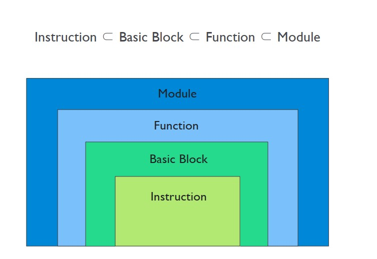
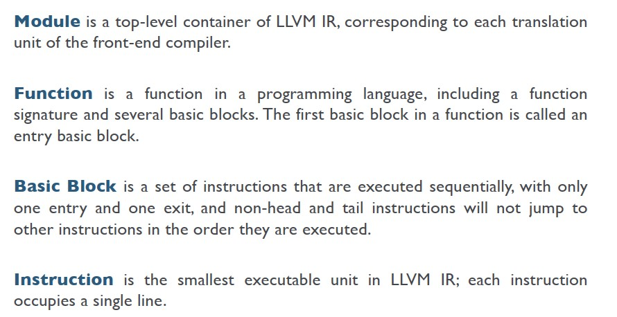
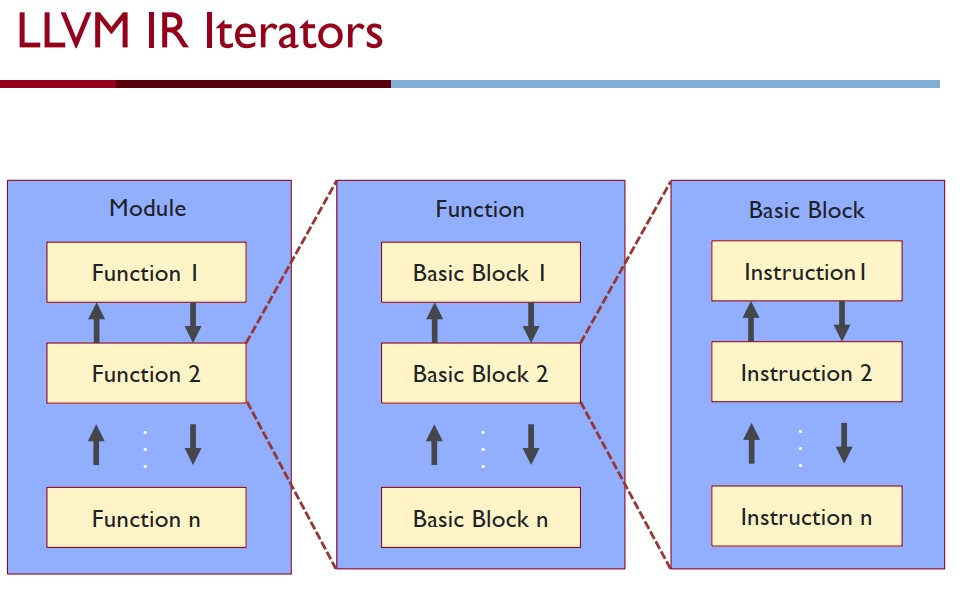

# Lab2
## 实验配置文件修改
首先需要修改CMakeList.txt里面的使用的llvm版本，需要与本地的版本适配，可以使用`llvm-as --version`查看
``` cmake
find_package(LLVM 15 REQUIRED CONFIG)
```

对于高版本的llvm，需要修改`/lab2/test/Makefile`文件里opt加载`.so`文件的命令，添加`-enable-new-pm=0`选项
``` makefile
%: %.c
	clang -emit-llvm -S -fno-discard-value-names -c -o $@.ll $< -g
	opt -load ../build/StaticAnalysisPass.so  -StaticAnalysisPass -enable-new-pm=0 -S $@.ll -o $@.static.ll
	opt -load ../build/DynamicAnalysisPass.so  -DynamicAnalysisPass -enable-new-pm=0 -S $@.ll -o $@.dynamic.ll
	clang -o $@ -L${PWD}/../build  -lruntime $@.dynamic.ll 
```
还需要添加链接器寻找动态库的文件路径，由于`/usr/bin/ld`或`/bin/ld`的动态链接器默认寻找的动态库链接路径为`/usr/lib`或`/lib`，而我们自定义了一个动态链接文件在`libruntime.so`在build中，所以需要添加动态链接的路径
``` shell
export LD_LIBRARY_PATH=/home/xxx/cis547/lab2/build
```
## 实验手册和知识点

llvm的基本结构和关系







实现手册主要是llvm的官方文档，查看API和继承关系很方便，本次实验主要需要看这几个头文件和相关的继承关系(这也很重要)
+ llvm/IR/Instruction.h
+ llvm/IR/Module
+ llvm/IR/Function
+ llvm/IR/User.h
+ llvm/IR/Type
+ llvm/IR/Constant.h

主要的继承关系

```
BinaryOperator : Instruction : User
```
主要用到的函数
``` c++
#include "llvm/IR/Instruction.h"
bool isBinaryOp(); //返回这个指令是否是一个二元运算指令
unsigned getOpcode(); //返回这个指令操作符的标识

#include "llvm/IR/Module"
Module M;
constStringRef getName() const //返回模块名
constiterator_range<iterator>functions() //返回模块里面指向函数的迭代器的集合
for(auto &F:M.functions()) {}


#include "llvm/IR/Function"
unsigned getInstructionCount() const //返回这个函数里面不是debug信息的指令(instructions)的条数

#include "llvm/IR/User.h"
Value *getOperand(unsigned i); //返回第i个操作数
```

## 具体实验实现

### Static Analysis
直接PASS的时候识别即可
``` c++
bool Instrument::runOnFunction(Function &F) {
  auto FunctionName = F.getName().str();
  outs() << "Running " << PASS_DESC << " on function " << FunctionName << "\n";

  outs() << "Locating Instructions\n";
  for (inst_iterator Iter = inst_begin(F), E = inst_end(F); Iter != E; ++Iter) {
    Instruction &Inst = (*Iter);
    llvm::DebugLoc DebugLoc = Inst.getDebugLoc();
    if (!DebugLoc) {
      // Skip Instruction if it doesn't have debug information.
      continue;
    }

    int Line = DebugLoc.getLine();
    int Col = DebugLoc.getCol();
    outs() << Line << ", " << Col << "\n";

	 if(!Inst.isBinaryOp () ) continue;
	 Value *op1=Inst.getOperand(0);
	 Value *op2=Inst.getOperand(1);

	 outs()<<getBinOpName(getBinOpSymbol((Instruction::BinaryOps)Inst.getOpcode()))<<" at Line "<<Line<<" ,Colnum "<<Col<<" and fisrt oprand is "<<variable(op1)<<" second oprand is "<<variable(op2)<<"\n";
  }
  return false;
}
```
### Dynamic Analysis
动态PASS的时候就不能直接opt输出了，需要用clang编译`.ll`文件然后运行可执行文件PASS。
动态PASS的思路就是函数插桩，如果需要获得一条指令的信息，可以构造需要一个函数并传入需要的信息。不过这个插桩函数需要先在模块中注册，形式是
``` c++
Module *M;
M->getOrInsertFunction(FunctionName,RetType,Arg1Type,Arg2Type ...)
```
我们这里需要实现`instrumentBinOpOperands()`函数，参考`instrumentCoverage`的形式实现，我们需要先设置函数的参数向量，类型和个数需要和注册时的一致，给出实现
``` c++
bool Instrument::runOnFunction(Function &F){
	...
	M->getOrInsertFunction(BINOP_OPERANDS_FUNCTION_NAME, VoidType, Int8Type,
                         Int32Type, Int32Type, Int32Type, Int32Type);
    ...
}
void instrumentBinOpOperands(Module *M, BinaryOperator *BinOp, int Line,
                             int Col) {
  auto &Context = M->getContext();
  auto *Int32Type = Type::getInt32Ty(Context);
  auto *CharType = Type::getInt8Ty(Context);

  auto binop = ConstantInt::get(CharType,getBinOpSymbol(BinOp->getOpcode())); //Int8Type
  auto LineVal = ConstantInt::get(Int32Type,Line); //Int32Type
  auto ColVal = ConstantInt::get(Int32Type,Col); //Int32Type
  
  std::vector<Value *> Args = {binop, LineVal, ColVal, BinOp->getOperand(0),BinOp->getOperand(1)}; //由于是Value*类型，直接传这个类型即可
  auto *BinOpFunction = M->getFunction(BINOP_OPERANDS_FUNCTION_NAME);
  CallInst::Create(BinOpFunction, Args, "", BinOp);

}
```
一些细节
``` c++
M->getFunction(FunctionName); //只可以在动态链接库中找的函数
CallInst::Create(Function *f, Args, "",Instruction *I );
//将插桩函数插入到指令I之前
```