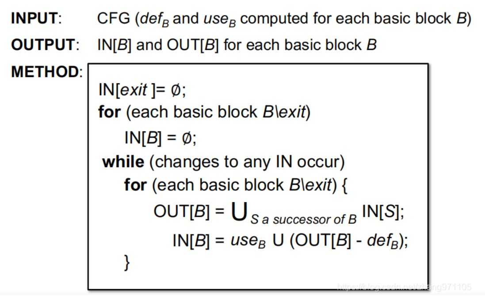

# Dataflow Analysis(静态分析)

## Reaching Definitions Analysis(可达定义分析)

定义：在程序点$p$处的一个定义$d$，到程序点$q$是可达的，当且仅当：
+ 程序点$p$和$q$之间存在一条路径
+ 该定义$d$生成的变量$v$没有被重新定义或赋值

这里所说的可达定义并不是指$v$这个变量，而是这在程序点$p$处时定义的$v$的状态。而我们一般使用行号来指代一处定义$d_i$，因此可能一个变量$v$会产生多个$d_i$，而我们只关注$d_i$的可达情况。实现一般是抽象一个比特向量来表示这些$d_i$是否存在

可达定义属于$\text{may}$分析

算法(前向分析)：

里面的$\text{kill}[n]$可以理解为在当前来到程序点$n$(可能是一个基本块或一个语句)，对于其中的所有定义，假设某个定义的变量的$v$，它所在的定义抽象表示为$d_i$，那么对于处$n$外的程序点，凡是出现了$v$的定义$d_j$，都包含在$\text{kill}[n]$


## Live Variables Analysis
定义：变量$v$在程序点$p$是活跃的，当且仅当
+ 存在$p$可达的程序点$q$，并且$q$中有使用到变量$v$
+ 在$p\rightarrow q$的路径上，变量$v$没有被重新定义

算法(逆向分析)：
+ $\text{USE}[B]$是基本块$B$中所有程序点$p_i:v_i=E_i(args_i)$中$args_i$的集合




## Very Busy Expressions Analysis
定义：在一个基本块$B$中的某条语句类似于$d_i: v=E(args)$，我们称表达式$E$是very busy的当且仅当表示式$E$中的变量$args$被重新定义之前，数据流经过的每一条路径上都有用到这个表达式$E$

算法(后向分析算法)
+ $\text{KILL}[B]={E:\text{E is not in B and E contians the values which are defined in B} }$


## Available Expressions Analysis
定义：一个程序点$p:v=E(args)$的表达式$E$是available(可替换的)当且仅当
+ 从$\text{Entry}$到$p$的所有路径必须包含$E$
+ 最后一次使用$E$之后，没有重新定义$args$

因此如果一个表达式是available，就可以先算出它的值然后直接用一个变量替代，减少计算量

算法(前向算法)：


## 任务实现：除0错误判断
DivZeroAnalysis.cpp
``` cpp
//当判断除法的第二个操作室的抽象域是Zero或MaybeZero即可返回除0错误
bool DivZeroAnalysis::check(Instruction *Inst) {
  if(!Inst->isBinaryOp()) return false;
  unsigned Opcode=Inst->getOpcode();
  if(Opcode==Instruction::UDiv || Opcode==Instruction::SDiv){
     Value *Op2=Inst->getOperand(1);
     Domain *Op2Domain=getOrExtract(InMap[Inst],Op2);
     return Domain::equal(*Op2Domain,Domain(Domain::Zero)) 
            || Domain::equal(*Op2Domain,Domain(Domain::MaybeZero));
  }
  return false;
}
```

Transfer.cpp
```cpp
//二元操作，直接判断即可
Domain *eval(BinaryOperator *BinOp, const Memory *InMem) {
   Value *Op1=BinOp->getOperand(0);
   Value *Op2=BinOp->getOperand(1);
   unsigned Opcode=BinOp->getOpcode();
   Domain *E1=getOrExtract(InMem,Op1), *E2=getOrExtract(InMem,Op2);
   //outs()<<(*E1)<<" "<<(*E2)<<"\n";
   switch(Opcode){
    case Instruction::Add:
    case Instruction::FAdd:
        return Domain::add(E1,E2);
    case Instruction::Sub:
    case Instruction::FSub:
        return Domain::sub(E1,E2);
    case Instruction::Mul:
    case Instruction::FMul:
        return Domain::mul(E1,E2);
    case Instruction::UDiv:
    case Instruction::SDiv:
    case Instruction::FDiv:
        return Domain::div(E1,E2);
    default:
        return NULL;
   }
}
//类型转换操作，可以需要考虑无符号数和有符号数的关系，但这里我就直接返回一样的抽象域了
Domain *eval(CastInst *Cast, const Memory *InMem) {

    Value *Op=Cast->getOperand(0);
    return getOrExtract(InMem,Op);
}
//任务里指明了除了等于比较其它比较返回MaybeZero就可以了，所以特殊判断一下等于比较即可
Domain *eval(CmpInst *Cmp, const Memory *InMem) {
   CmpInst::Predicate cmp=Cmp->getPredicate();
   Value *Op1=Cmp->getOperand(0);
   Value *Op2=Cmp->getOperand(1);
   Domain *E1=getOrExtract(InMem,Op1), *E2=getOrExtract(InMem,Op2);
   switch(cmp){
    case CmpInst::Predicate::ICMP_EQ:
        if(Domain::equal(*E1,*E2)) return new Domain(Domain::NonZero);
        else return new Domain(Domain::Zero);
    default:
        return new Domain(Domain::MaybeZero);
   }
   return NULL;
}
```
ChaoticIteration.cpp
``` cpp
//集合的并操作
Memory *join(Memory *Mem1, Memory *Mem2) {
    Memory *Ret=new Memory;
    for(auto &[key,value]:*Mem1){
        if(Mem2->find(key)==Mem2->end()){
            (*Ret)[key]=value;
        }else{
            (*Ret)[key]=Domain::join(value,(*Mem2)[key]);
        }
    }
    for(auto &[key,value]:*Mem2){
        //outs()<<key<<"\n";
        if(Mem1->find(key)==Mem1->end()){
            //outs()<<"==============\n";
            (*Ret)[key]=value;
        }
    }
    return Ret;
}
//和join差不多的写法
bool equal(Memory *Mem1, Memory *Mem2) {
  for(auto &[key,value]:*Mem1){
    if(Mem2->find(key)!=Mem2->end()){
        if(Domain::equal(*value,*(*Mem2)[key])) continue;
        else return false;
    }else{
        if(!Domain::equal(*value,Domain(Domain::Uninit))) return false;
    }
  }

  for(auto &[key,value]:*Mem2){
    if(Mem1->find(key)!=(*Mem1).end()){
        continue;
    }else{
        if(!Domain::equal(*value,Domain(Domain::Uninit))) return false;
    }
  }
  return true;
}
void DivZeroAnalysis::flowOut(Instruction *Inst, Memory *Pre, Memory *Post,
                              SetVector<Instruction *> &WorkSet) {

   if(!equal(Pre,Post)){
     auto SucInsts=getSuccessors(Inst);
     for(auto SucInst:SucInsts){
        WorkSet.insert(SucInst);
     }
   }
   OutMap[Inst]=Post;
}
//每太看懂任务给的提示，感觉少了一些东西。这里使用Reaching Definitions Analysis的算法,也不是很清楚这里的Post和Pre是什么意思，大致按照自己的理解写了一下把测试样例过了
void DivZeroAnalysis::doAnalysis(Function &F) {
  SetVector<Instruction *> WorkSet;

   for (inst_iterator Iter = inst_begin(F), End = inst_end(F); Iter != End; ++Iter) {
        auto Inst = &(*Iter);
        WorkSet.insert(Inst);
    }

    while(!WorkSet.empty()){
        auto Inst=WorkSet.front();
        WorkSet.remove(Inst);
        flowIn(Inst,InMap[Inst]);
        Memory *Pre=OutMap[Inst];
        Memory *Gen=new Memory;
        transfer(Inst,InMap[Inst],*Gen);

        Memory *Post=new Memory;
        for(auto &[key,value]:*InMap[Inst]){
            (*Post)[key]=value;
        }
        for(auto &[key,value]:*Gen){
            (*Post)[key]=value;
        }
        flowOut(Inst,Pre,Post,WorkSet);

    }

}


```