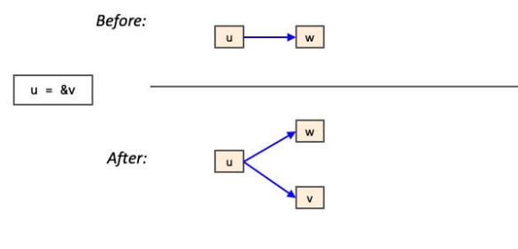

# Pointer Analysis(指针分析)

## 堆抽象
对于`new`、`malloc`等操作，它们分配的是堆中的内存，所以这类分析一般称为堆抽象
## 栈抽象
在`c`中，常用的是`*`和`&`来表示指针和取地址，而这些指针指向不止像堆内存，所以这样的分析称为栈抽象

常见的操作有
``` c
s::= v1=&v2
   | v1=v2
   | v1=*v2
   | *v1=v2
```

指针指向关系传递




## 任务实现：非过程间的静态指针分析

 Transfer.cpp
 ``` cpp
 void DivZeroAnalysis::transfer(Instruction *Inst, const Memory *In,
                               Memory &NOut, PointerAnalysis *PA,
                               SetVector<Value *> PointerSet) {
  if (isInput(Inst)) {
    // The instruction is a user controlled input, it can have any value.
    NOut[variable(Inst)] = new Domain(Domain::MaybeZero);
  } else if (auto Phi = dyn_cast<PHINode>(Inst)) {
    // Evaluate PHI node
    NOut[variable(Phi)] = eval(Phi, In);
  } else if (auto BinOp = dyn_cast<BinaryOperator>(Inst)) {
    // Evaluate BinaryOperator
    NOut[variable(BinOp)] = eval(BinOp, In);
  } else if (auto Cast = dyn_cast<CastInst>(Inst)) {
    // Evaluate Cast instruction
    NOut[variable(Cast)] = eval(Cast, In);
  } else if (auto Cmp = dyn_cast<CmpInst>(Inst)) {
    // Evaluate Comparision instruction
    NOut[variable(Cmp)] = eval(Cmp, In);
  } else if (auto Alloca = dyn_cast<AllocaInst>(Inst)) {
    // Do nothing here.
  } else if (auto Store = dyn_cast<StoreInst>(Inst)) {
    Value *Pointer = Store->getPointerOperand();
    Value *Value = Store->getValueOperand();
    std::string strpointer=variable(Pointer);
    Domain *E=getOrExtract(In,Value);
    if(NOut.find(strpointer)==NOut.end()) NOut[strpointer]=E;
    else NOut[strpointer]=Domain::join(NOut[strpointer],E);
    for(auto val:PointerSet){
        std::string str=variable(val);
        if (AllocaInst *Alloca = dyn_cast<AllocaInst>(val)) str=address(Alloca);
        if(PA->alias(strpointer,str)){
            if(NOut.find(variable(val))==NOut.end()) NOut[variable(val)]=E;
            else NOut[variable(val)]=Domain::join(NOut[variable(val)],E);
        }
    }
    for(auto val1:PointerSet){
        std::string str1=variable(val1);
        if (AllocaInst *Alloca1 = dyn_cast<AllocaInst>(val1)) str1=address(Alloca1);
        //需要使用O(n^2)的算法来更新指针指向
        for(auto val2:PointerSet){
            std::string str2=variable(val2);
            if (AllocaInst *Alloca2 = dyn_cast<AllocaInst>(val2)) str2=address(Alloca2);
            if(str2!=str1){
                if(PA->alias(str1,str2)){
                    if(NOut.find(str1)==NOut.end() && NOut.find(str2)==NOut.end()) continue;
                    else if(NOut.find(str1)==NOut.end() && NOut.find(str2)!=NOut.end()) NOut[str1]=NOut[str2];
                    else if(NOut.find(str1)!=NOut.end() && NOut.find(str2)!=NOut.end())NOut[str1]=Domain::join(NOut[str1],NOut[str2]);
                }
            }
        }
    }

  } else if (auto Load = dyn_cast<LoadInst>(Inst)) {
     Value *Pointer=Load->getPointerOperand();
     if(NOut.find(variable(Load))==NOut.end()) NOut[variable(Load)]=getOrExtract(In,Pointer);
     else NOut[variable(Load)]=Domain::join(NOut[variable(Load)],getOrExtract(In,Pointer));
     
  } else if (auto Branch = dyn_cast<BranchInst>(Inst)) {
    // Analysis is flow-insensitive, so do nothing here.
  } else if (auto Call = dyn_cast<CallInst>(Inst)) {
    //对于Int类型的返回值，我这里直接返回了MaybeZero
     std::string cur_value=variable(Call);
     Function *func=Call->getCaller ();
     Type *RetType=func->getReturnType ();
     if(auto ptr=dyn_cast<IntegerType>(RetType)){
        NOut[variable(Cmp)]=new Domain(Domain::MaybeZero);
     }else NOut[variable(Cmp)]=new Domain(Domain::Uninit);
  } else if (auto Return = dyn_cast<ReturnInst>(Inst)) {
    // Analysis is intra-procedural, so do nothing here.
  } else {
    errs() << "Unhandled instruction: " << *Inst << "\n";
  }
}
 ```
ChaoticIteration.cpp
``` cpp
//勉强过了样例
void DivZeroAnalysis::doAnalysis(Function &F, PointerAnalysis *PA) {
  SetVector<Instruction *> WorkSet;
  SetVector<Value *> PointerSet;
    for(auto &arg:F.args()){
        PointerSet.insert(&arg);
    }

   for (inst_iterator Iter = inst_begin(F), End = inst_end(F); Iter != End; ++Iter) {
        auto Inst = &(*Iter);
        WorkSet.insert(Inst);
        PointerSet.insert(Inst);
    }
    
    while(!WorkSet.empty()){
        auto Inst=WorkSet.front();
        WorkSet.remove(Inst);
        flowIn(Inst,InMap[Inst]);
        Memory *Pre=OutMap[Inst];
        Memory *Gen=new Memory;
        transfer(Inst,InMap[Inst],*Gen,PA,PointerSet);
        Memory *Post=new Memory;
        for(auto &[key,value]:*InMap[Inst]){
            (*Post)[key]=value;
        }
        for(auto &[key,value]:*Gen){
            (*Post)[key]=value;
        }
        flowOut(Inst,Pre,Post,WorkSet);
    }
}
```